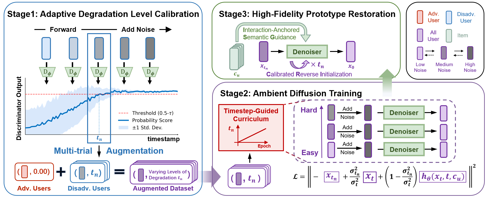

# FairDiff: Enhancing User-Oriented Fairness via Ambient Diffusion Restoration


## 💡 Introduction

<p align="center">
 
</p>

Addressing the User-Oriented Fairness (UOF) issue is a critical challenge in recommender systems (e.g., short-video platforms), as models tend to generate lower-fidelity embeddings for users with sparse signals. Many existing approaches simplify this issue using a binary advantaged/disadvantaged dichotomy. In terms of evaluation, such group-level metrics obscure intra-group unfairness. Methodologically, overlooking the continuous spectrum of embedding degradation homogenizes disadvantaged users, which discards the residual signals essential for global interest modeling. Consequently, existing knowledge transfer methods forcibly align their degraded embeddings with limited advantaged prototypes, ultimately causing interest distribution collapse. To address these problems, we first introduce a fine-grained fairness evaluation metric based on Optimal Transport to capture the distributional unfairness across the entire population. Furthermore, we propose FairDiff, a novel framework that employs Curriculum-Scheduled Ambient Diffusion to adaptively restore degraded embeddings by modeling high-fidelity interest distribution. Instead of indiscriminately discarding information from degraded embeddings, we incorporate the entire spectrum of user data into training by explicitly modeling their varying degradation levels. Consequently, this enriches the learned interest distribution without sacrificing its high fidelity, ultimately enhancing both overall utility and fairness. Extensive evaluations in both ID-based and multimodal scenarios, coupled with online A/B testing on a real-world short-video platform, demonstrate the effectiveness of our method. 

## 📦 Environment Setup

The following commands create the validated Python 3.10 Conda environment. The PyTorch CUDA 11.8 wheel is compatible with the server's CUDA 12.2 driver.

```bash
conda create -y -n fairdiff python=3.10
conda activate fairdiff

python -m pip install --index-url https://download.pytorch.org/whl/cu118 torch==2.7.1
python -m pip install numpy==1.26.4 scipy==1.15.3 geomstats==2.8.0 matplotlib==3.10.3 tqdm==4.67.1 PyYAML==6.0.2 tqdm==4.67.1
```

## 🪧 Dataset

We utilize the **MovieLens-1M** dataset for our experiments.
- **Source**: The original dataset can be downloaded from [https://grouplens.org/datasets/movielens/](https://grouplens.org/datasets/movielens/).
- **Preprocessing**: We provide `split.py` to handle the preprocessing of raw interaction data and dataset splitting.


## 🏋️ Code Usage

To train and evaluate **FairDiff** using the default **PMF** backbone, run the following command:

```bash
CUDA_VISIBLE_DEVICES=0 python main.py --config main.yaml
```


## 📚 Citation

If you find this repository useful, please cite:

```bibtex
@inproceedings{qin2026fairdiff,
  author    = {Qin, Chenyang and Wang, Xin and Shu, Hantao and
               Qin, Simiao and Ling, Cheng and Chen, Xiaoshuang and
               Zhan, Kaiqiao and Zhu, Wenwu},
  title     = {FairDiff: Enhancing User-Oriented Fairness via
               Curriculum-Scheduled Ambient Diffusion},
  booktitle = {Proceedings of the 34th ACM International Conference on Multimedia},
  year      = {2026},
  doi       = {10.1145/3767308.3835412}
}
```
